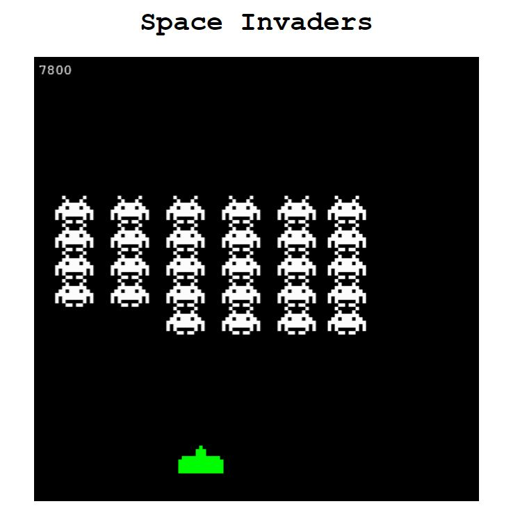

# Space Invaders: A JavaScript Game

### This JavaScript code brings the classic arcade game Space Invaders to life in your web browser! Defend your ship against waves of alien invaders, earning points for each alien destroyed.

## Features:

- Authentic Gameplay: Move your ship left and right, firing bullets to take down aliens. Experience the nostalgic thrill of Space Invaders!
- Progressive Difficulty: As you eliminate aliens, they move faster and new waves spawn with more enemies, keeping the game challenging.
- Score Tracking: Your score is displayed in the top left corner, motivating you to improve your performance.
- Clean and Maintainable Code: The code is well-structured, with comments for clarity and separation of concerns for easier future modifications.

## Getting Started

- Prerequisites: Ensure you have a basic understanding of HTML, CSS, and JavaScript.

1. Set Up Files:
2. Create two files: space.html and space.js.
3. Copy the HTML code provided in this README into space.html.
4. Copy the JavaScript code provided in this README into space.js.

- Run the Game:

1. Open the space.html file in your web browser to start playing.
   -Code Breakdown

## The code is organized into several key functions:

- window.onload: This function executes when the web page finishes loading. It - performs the following tasks:
- Retrieves a reference to the HTML canvas element with the ID "board".
- Sets the width and height of the canvas to create the game board.
- Obtains the 2D drawing context for the canvas, used for drawing game elements.
- Loads images for the ship and alien.
- Starts the game loop using requestAnimationFrame for smooth animation.
- Adds event listeners for "keydown" and "keyup" events to handle ship movement and shooting.
- update: This function is called repeatedly within the game loop, responsible for updating the game state and drawing the game elements. Here's what it does:
- Clears the canvas to prepare for a new frame.
- Draws the ship image on the canvas.
- Loops through the alienArray to update alien positions and draw them on the canvas. If an alien reaches the ship's level, triggers game over.
- Loops through the bulletArray to update bullet positions and draw them on the canvas. Checks for collision between bullets and aliens, removing both from their respective arrays and incrementing the score upon successful hits.
- Cleans up bullets that move off the top of the canvas.
- Handles next-level logic if all aliens are destroyed: increases alien count, creates a new wave with more aliens, and adjusts alien movement speed.
- Displays the current score on the canvas.
- moveShip: This function detects key presses (left and right arrows) and moves the ship left or right within the canvas boundaries, ensuring it stays on the game board.
- createAliens: This function creates a two-dimensional array of alien objects, initializing their positions, images, width, height, and "alive" status. It populates the alienArray with these objects.
- shoot: This function detects the spacebar press and creates a new bullet object at the ship's position. It pushes the bullet object onto the bulletArray.
  detectCollision: This function takes two objects as arguments and checks for collision using bounding box intersection logic. It returns true if a collision occurs, otherwise false.

## Cloning to GitHub

- Create a GitHub Account: If you don't have one already, sign up for a free GitHub account at https://github.com/Francys04/space_invaders_js.git
- Create a New Repository: Navigate to your GitHub profile and create a new repository. Give it a name like "Space-Invaders-Game".

## Customization

- You can modify various aspects of the game to fine-tune the difficulty and experience:
- Change the initial and incremental values of alienVelocityX to adjust the speed of alien movement.
- Experiment

